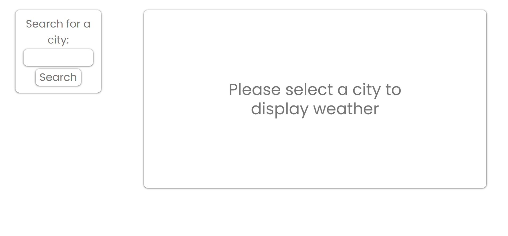

# five-day-forecast ⛈️

A weather dashboard capable of showing you any city's weather in the world! The dashboard shows the current weather conditions given by city along with a five day forecast for the location. Included in the data is the min and max temps for the day. The humidity and wind speed. Along with the general overall conditions of the weather for the given time period.

## Table of Contents (Optional)

- [Installation](#installation)
- [Usage](#usage)
- [Credits](#credits)
- [License](#license)

## Installation

N/A

## Usage

The purpose of this site is to retrieve and display weather for any city in the world. It utilizes the [Open Weather Map API](https://openweathermap.org/api) which provides update-to-date information on the world's weather.

Link to the website deployed on GitHub Pages: https://mforte215.github.io/five-day-forecast/

Link to the code repository on GitHub: https://github.com/mforte215/five-day-forecast/

A screenshot of the current site:

## Credits

N/A

## License

Please refer to the LICENSE in the repo
